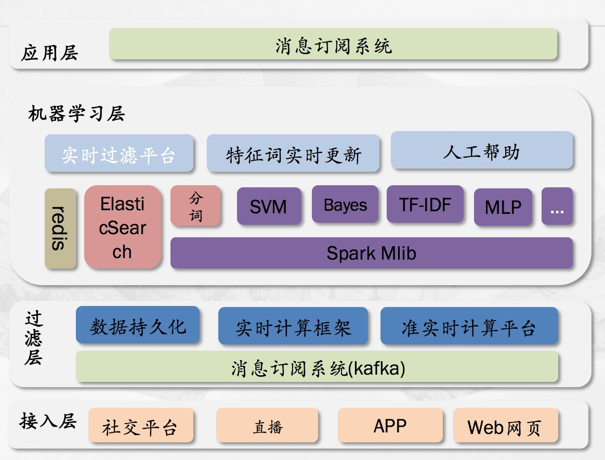
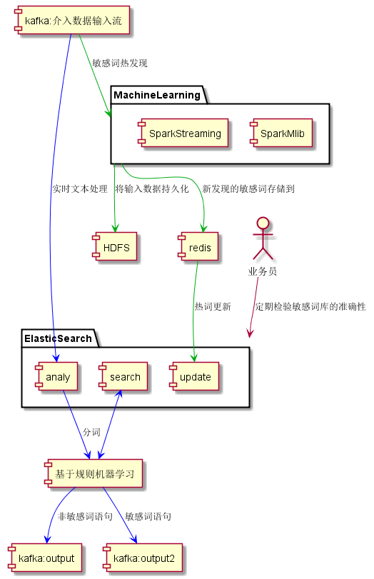
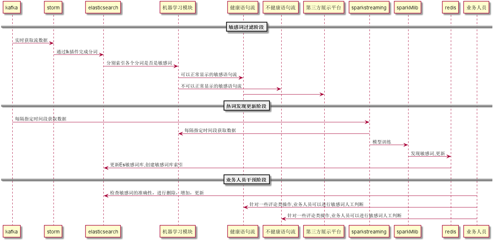

#机器学习文本过滤系统模块设计

## 整体设计
本文涉及到Hadoop、spark、Elasticsearch，redis、Kafka、storm 

### 流程图

### 时序图

##配置文件模块
配置文件主要是完成上文中涉及到几个组件之间地址、端口、及所涉及到的数据主题的名称等配置，全部放在配置文件conf.properties
## 日志能力
使用log4j记录各个调用的信息
## elasaticsearch 功能模块
* ES 查询，创建，删除功能接口

	为了后期对敏感词进行操作，需要提供通过ES获取数据的相关操作能力，这里提供创建，查询，删除接口
* ES 分词功能
ES的分词是通过IK完成，调用ES的analyze功能完成，其中需要修改ES IK组件，支持通过redis完成热更新
* 热更新
	* 需要修改IK的配置文件来获取redis集群的信息
	* 词库更新：修改原热词更新模块，完成词库更新，同时将热词写到指定文件中，保证下次重启时，可以直接从文件完成词库更新
	* 索引更新：将新生成的分词创建索引

* 通过文件创建ES的敏感词索引
所有敏感词最终会落地到文件中，在第一次时通过文件创建敏感词索引
* 敏感词判断功能
先通过***ES 分词功能***完成分词，在对每一个分词进行敏感词判断
## 敏感词过滤模块
* storm 功能描述
storm从指定kafka流获取文本数据，然后调用***敏感词判断功能***进行敏感词判断，如果是敏感词则直接输入到指定kafka流1，如果不是则输入到kafka流2

## 敏感词发现模块
* streaming 获取流数据

	streaming 通过kafka 获取数据 

* spark 操作ES

	spark 可以调用ES的分析（完成分词）
* spark mlib
是所有操作中最核心的功能模块
* 存储hdfs
* 发现新词存入到redis中

	

